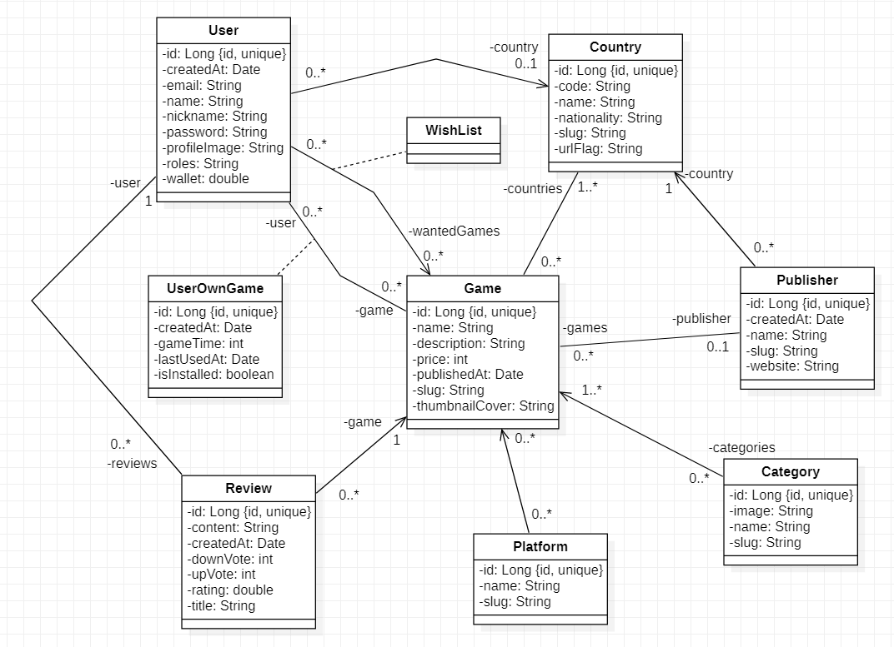

### Exo SpringBoot 03/01/2024

Voici le diagramme UML de l'application sur laquelle nous allons travailler.

#### 1. Les entités

- Faire les entités relatives à ce diagramme UML avec leur relation
- Des données vous seront remises après pour vérifier votre schéma de base de données

#### 1. Les repository

- Faire les repository des entités créées précédemment

#### 1. Les controllers d'API

- Faire les controllers d'API pour les entités suivantes (ordre à respecter) :
  - Country :
    - list / index (tout)
    - show (tout)
  - Category  :
    - list / index (tout)
    - show (tout)
  - Game :
    - list / index :
      - game.slug
      - game.name
      - game.thumbnailCover
      - game.price
    - show (tout) :
      - game.*
      - game.countries :
        - country.slug
        - country.urlFlag
        - country.name
      - game.categories :
        - category.slug
        - category.name
      - game.platforms :
        - platform.slug
        - platform.name
      - game.publisher :
        - publisher.name
        - publisher.slug
      - game.reviews :
        - review.createdAt
        - review.content
        - review.title
        - review.rating
        - review.upVote
        - review.downVote
        - review.user :
          - user.name
          - user.profileImage
  - UserOwnGame :
    - rien pour le moment !
  - Review :
    - list / index (tout)
      - review.*
      - review.user :
        - user.name
        - user.profileImage
      - review.game :
        - game.name
        - game.slug
        - game.thumbnailCover
        - game.price
  - Publisher
    - show :
      - publisher.*
      - publisher.country :
        - country.slug
        - country.urlFlag
        - country.name
      - publisher.games :
        - games.name
        - games.slug
        - games.thumbnailCover
        - games.price
  - User :
    - list / index :
      - user.email
      - user.name
      - user.nickname
      - user.profileImage
      - user.country :
        - country.slug
        - country.urlFlag
        - country.name
    - show :
      - user.*
      - user.wantedGames :
        - games.name
        - games.slug
        - games.thumbnailCover
        - games.price
      - user.country :
        - country.slug
        - country.urlFlag
        - country.name
      - user.userOwnGames :
        - userOwnGames.gameTime
        - userOwnGames.createdAt
        - userOwnGames.lastUsedAt
        - userOwnGames.isInstalled
        - userOwnGames.game :
          - games.name
          - games.slug
          - games.thumbnailCover
          - games.price
      - user.reviews :
        - review.createdAt
        - review.content
        - review.title
        - review.rating
        - review.upVote
        - review.downVote
        - review.game :
          - games.name
          - games.slug
          - games.thumbnailCover
          - games.price

 