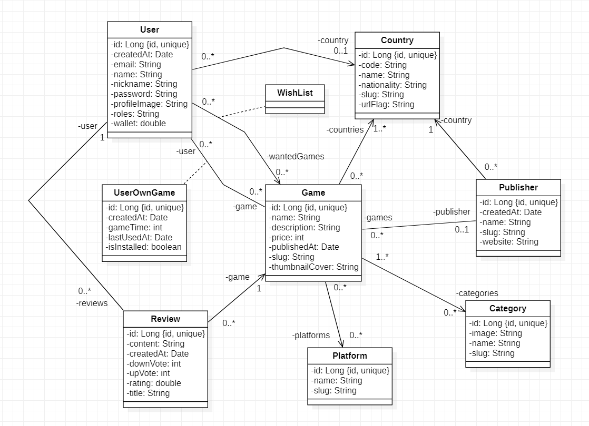

### Exo SpringBoot 03/01/2024

Voici le diagramme UML de l'application sur laquelle nous allons travailler.

#### 1. Les entités

- Faire les entités relatives à ce diagramme UML avec leur relation
- Des données vous seront remises après pour vérifier votre schéma de base de données

 