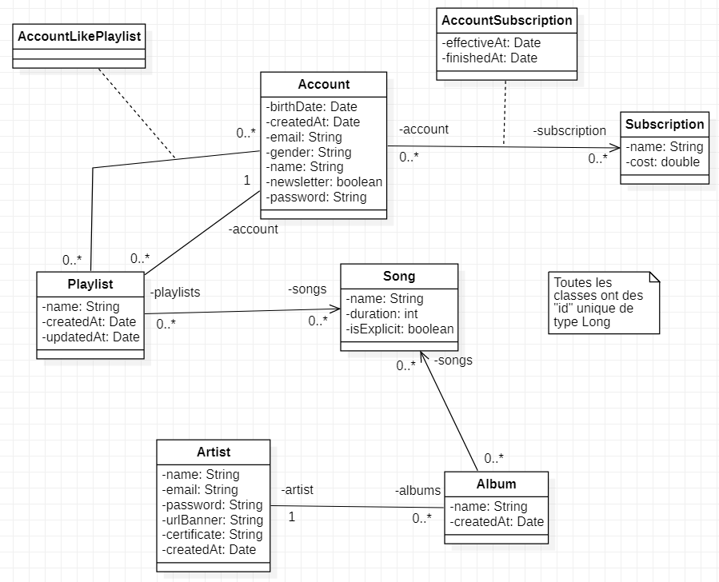

### Exo entrainement - SpringBoot 04/01/2024

Voici le diagramme UML de l'application sur laquelle nous allons travailler.

#### 1. Les entités

- Faire les entités relatives à ce diagramme UML avec leur relation
